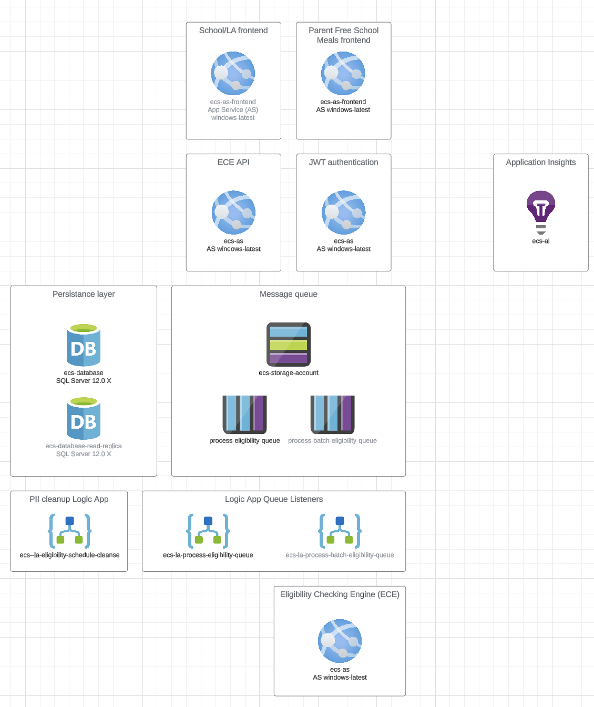
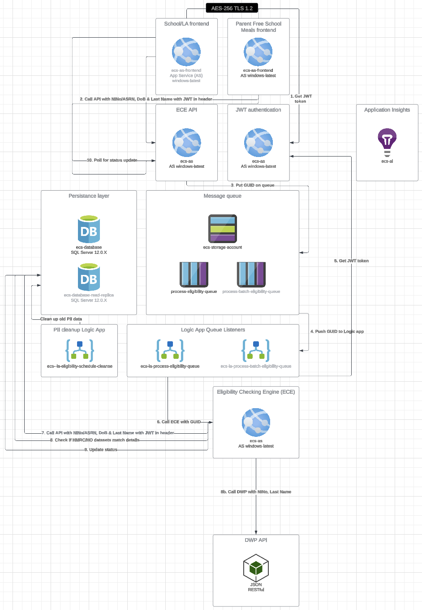
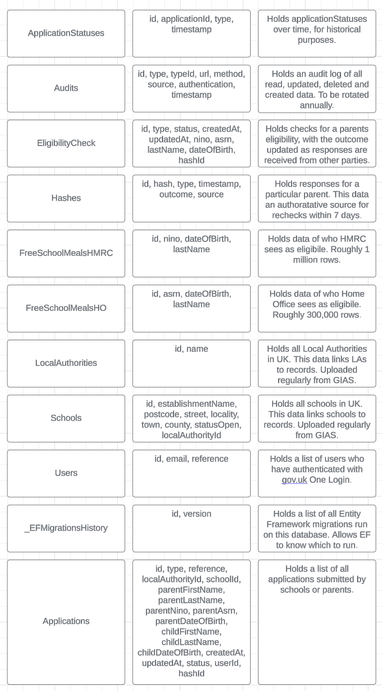
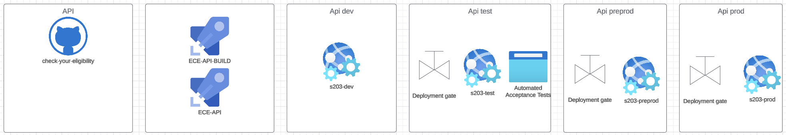

# Check Your Eligibility API
This repo contains the API for Eligibility Checking Engine (ECE) and the Check Free School Meals (FSM) service.

## Setup
This is a .NET 8 project - you'll need the latest .NET SDK etc to run it locally.

### Config

When you first clone the repo, you'll want to define your own config. You'll want to copy up the 
file [appsettings.json](CheckYourEligibility.WebApp/appsettings.json), name the copy `appsettings.developmnent.json`
in the same folder. Update the values in this new file as needed. This file should not be committed, nor will it with our .gitignore.

#### Credentials
You can get the credentials through following the instructions in [check-your-eligibility-infrastructure](https://github.com/DFE-Digital/check-your-eligibility-infrastructure).
Otherwise, just ask your Lead Developer or fellow colleague.

### Queue
There is a Azure Storage Queue part of the whole flow, which triggers a logic app. You can either ignore that part of the application, mock it, or connect to the dev queue. Credentials in keyvault.

## JWT authenticate your request
Each request needs to be authenticated with a JWT token. YOu get this token bu calling `/api/Login` with the following object:
`
{
    "username": "",
    "emailAddress": "ecsUi@education.gov.uk",
    "password": ""
}` inserting your username and password. 

Any errors will be seen in the Response Headers

Postman collection below automates this.

## How to run tests
We have two test-suites - one .NET NUnit for unit tests and one Cypress for integration and e2e tests. Cypress needs a running application responding to http calls.

### .NET
VisualStudio does most of this for you, there'll be a button in your UI. Correctly set up Rider too.
`
cd CheckYourEligibility.APIUnitTests
dotnet test
`

### Cypress
Assuming you have NPM installed.
`
cd tests
npm install
export CYPRESS_API_HOST="https-path to localhost or remote"
export CYPRESS_JWT_USERNAME="JWT user username"
export CYPRESS_JWT_PASSWORD="JWT user password"
npm run e2e:chrome
`

Note, replace `export` with `set` in the above command for Windows.

## Ways of working
### Releasing code
We submit PRs into `main` for functioning code. The reviewer checks that the automated tests pass, then approve.

We expect the code reviewer to run the code locally, read through it and understand what it is trying to solve.

If approved, the original code-creator merges the PR and deletes the branch.

### Secrets
We don't commit active secrets to this repo. If we do, it is crucial to notify DM/TL/PO, rewrite git history and follow DfE processes.

## Postman scripts
You will find a very useful collection under [docs/ECS Dev.postman_collection.json](docs/ECS Dev.postman_collection.json).

Replace `{username}`, `{password}` and `{api_host}` with appropriate values (See Setup > Config).

## Swagger
You'll find a Swagger page on `/swagger/index.html` once you're running the application.

## Getting GIAS data
You need to download a CSV from [GIAS](https://get-information-schools.service.gov.uk/Downloads), selecting All Establishment Data -> Establishment Fields CSV.

The contents is then POSTed to `/importEstablishments`

## Resources
### Architecture

### Data flow

### Data structure

### Deployment

### Miscellaneous

#### Migrations

##### Run Latest migration
`dotnet ef update-database -project CheckYourEligibility.Data.Migrations`

##### How to add a migration
Add-Migration BaseMigration -project CheckYourEligibility.Data.Migrations
Add-Migration establishmentImport -project CheckYourEligibility.Data.Migrations
Add-Migration idxReference -project CheckYourEligibility.Data.Migrations
Add-Migration applicationStatus -project CheckYourEligibility.Data.Migrations
Add-Migration checkHash -project CheckYourEligibility.Data.Migrations
Add-Migration checkHashSource -project CheckYourEligibility.Data.Migrations
Add-Migration checkHashResult -project CheckYourEligibility.Data.Migrations
Add-Migration UserCreate -project CheckYourEligibility.Data.Migrations
Add-Migration Audit -project CheckYourEligibility.Data.Migrations
Add-Migration AuditTypeColumn -project CheckYourEligibility.Data.Migrations
Add-Migration ApplicationHash -project CheckYourEligibility.Data.Migrations
Add-Migration BulkUpload -project CheckYourEligibility.Data.Migrations
Add-Migration BulkUploadItemSequence -project CheckYourEligibility.Data.Migrations
Add-Migration UpdateStatus -project CheckYourEligibility.Data.Migrations

##### Update db to latest migration
update-database  -project CheckYourEligibility.Data.Migrations

##### List Migrations
Get-Migration

Remove-Migration -Force -project CheckYourEligibility.Data.Migrations

##### Run specific migration
update-database -migration BaseMigration -project CheckYourEligibility.Data.Migrations

#### MoqDWP
DWP checking:

Firstly the citizen is checked using the supplied details, if found Status200OK then the GUID is returned and a check is made to see if the citizen is eligible or not.
if an error occurs then this is logged and the eligibility check record is set to queuedForProcessing.  Status404NotFound is returned when the resource is not found.
the following are details used to force results.

`public static class MogDWPValues
    {
        public static string validUniversalBenefitType = "universal_credit";
        public static string validCitizenEligibleGuid = "58ccfe37-7e43-4682-a412-19ec663ca556";
        public static string validCitizenSurnameEligible = "Smith";
        public static string validCitizenNotEligibleGuid = "48ccfe37-7e43-4682-a412-19ec663ca556";
        public static string validCitizenSurnameNotEligible = "Jones";
        public static string validCitizenDob = "1990-01-01";
        public static string validCitizenNino = "AB123456C";
    }`

#### CURL commands

Using a valid check will enforce a valid result changing the surname to 'Jones' follows a different path

`curl --location 'https://localhost:7117/FreeSchoolMeals' \
--header 'accept: text/plain' \
--header 'Content-Type: application/json' \
--data '{
  "data": {
    "nationalInsuranceNumber": "AB123456C",
    "lastName": "Smith",
    "dateOfBirth": "1990-01-01",
    "nationalAsylumSeekerServiceNumber": null
  }
}'`

the moq dwp endpoints are as follows, note the headers.
`curl --location 'https://localhost:7117/MoqDWP/v2/citizens' \
--header 'accept: text/plain' \
--header 'instigating-user-id: abcdef1234577890abcdeffghi' \
--header 'policy-id: fsm' \
--header 'correlation-id: 4c6a63f1-1924-4911-b45c-95dbad8b6c37' \
--header 'context: abc-1-ab-x128881' \
--header 'Content-Type: application/json-patch+json' \
--data '{
  "jsonapi": {
    "version": "2.0"
  },
  "data": {
    "type": "Match",
    "attributes": {
      "dateOfBirth": "1990-01-01",
      "ninoFragment": "AB123456C",
      "lastName": "Smith"
    }
  }
}'`

`curl --location --request GET 'https://localhost:7117/MoqDWP/v2/citizens/58ccfe37-7e43-4682-a412-19ec663ca556/claims?benefitType=universal_credit%27' \
--header 'accept: text/plain' \
--header 'instigating-user-id: abcdef1234577890abcdeffghi' \
--header 'access-level: 1' \
--header 'correlation-id: 4c6a63f1-1924-4911-b45c-95dbad8b6c37' \
--header 'context: abc-1-ab-x128881' \
--header 'Content-Type: application/json-patch+json' \
--data '{
  "jsonapi": {
    "version": "2.0"
  },
  "data": {
    "type": "Match",
    "attributes": {
      "dateOfBirth": "1990-01-01",
      "ninoFragment": "AB123456C",
      "lastName": "DWPmoq"
    }
  }
}'`

## SQL
delete all data

delete [dbo].[ApplicationStatuses]
delete [dbo].Applications
delete EligibilityCheck
delete EligibilityCheckHashes