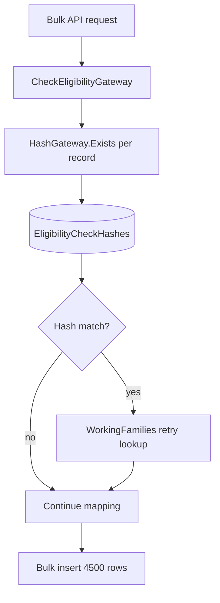
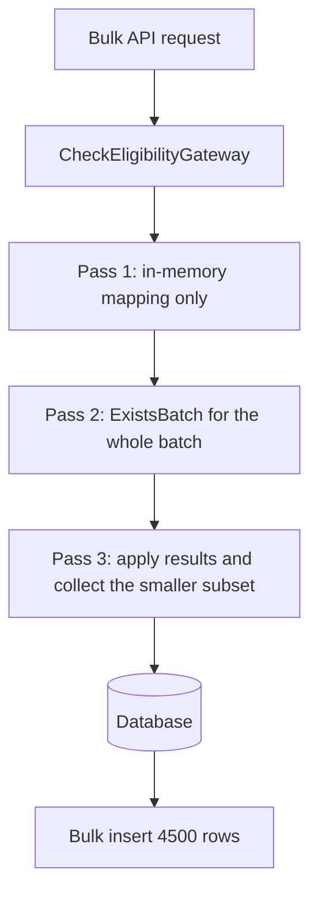
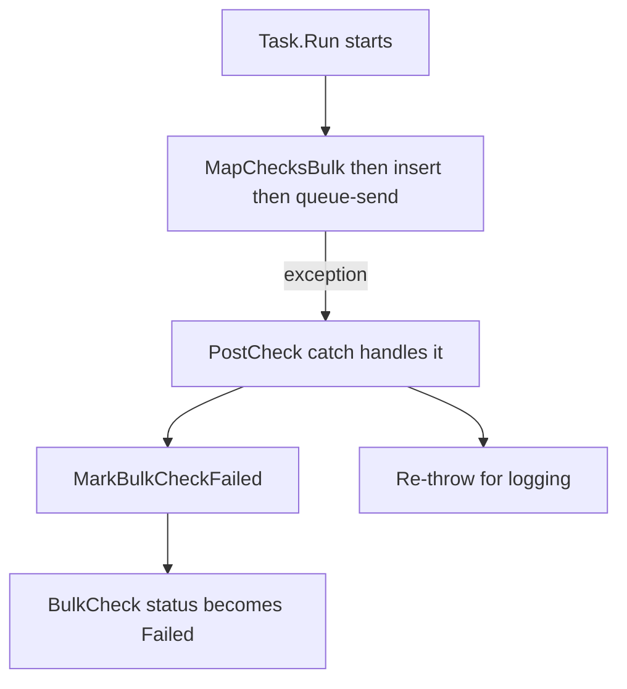

# Bulk check hash batching + Failed-status fix

**Branch:** `fix/ELIG-3354-bulk-check-hash-batching`
**Jira:** [ELIG-3354](https://dfedigital.atlassian.net/browse/ELIG-3354) - "Investigate performance pro/cons of check hashing mechanism..."

## The incident this fixes

Several WorkingFamilies bulk checks (org 919, and others) were found stuck at
`BulkCheck.Status = InProgress` forever - some with **zero** rows in `EligibilityCheck` at all, others
with all-but-a-handful of rows resolved and a few permanently stuck at `queuedForProcessing`.

Application Insights "End-to-end transaction" traces showed the *same* operation for a successful batch
and a failed one:

- **Successful**: many `SQL | EligibilityCheck` dependency calls -> a `Data: Commit` trace (the bulk
  insert committing) -> `QueueClient.SendMessage` -> `Action:SendMessageToQueue, Status:Success`.
- **Failed**: only a handful of `SQL | EligibilityCheck` calls with **escalating durations**
  (~22ms -> 400ms+), then the operation just stopped. No `Commit`, no queue send, no exception ever
  logged for that operation.

Root cause: `CheckEligibilityGateway.MapCheck` (called once per record, from a fire-and-forget
`Task.Run` in `CheckEligibilityBulkUseCase`) does **up to 4 sequential, awaited DB round-trips per
record**:

1. `HashGateway.Exists()` - one query against `EligibilityCheckHashes`.
2. For WorkingFamilies records that hash-match to `eligible`/`notEligible`: up to **3 retries**, each
   doing its own query against `CheckEligibilities`, spaced **1 second apart**.

For a 4,500-record batch that's up to **18,000 sequential round-trips**, plus up to **3.75 hours** of
cumulative `Task.Delay` in the worst case. Any transient blip (DB pool exhaustion, a slow moment, the
process being recycled) partway through this loop:

- Aborts the *whole* batch with **zero rows persisted** (the mapped list is only bulk-inserted once, at
  the very end, after the loop finishes).
- Was **never caught** by `PostCheck`'s only try/catch, because that try/catch wrapped just the
  insert+queue-send step, not the mapping loop above it. The `BulkCheck` row was left at `InProgress`
  forever with no error ever logged against it.

This is independently corroborated by [ELIG-3354](https://dfedigital.atlassian.net/browse/ELIG-3354),
which flagged the hashing mechanism as the highest DB I/O cost in check creation, from a pure
performance angle raised before this incident was connected to it.

## Fix 1: batch the hash lookups

Replaced the per-record loop with a small, fixed number of batched queries, regardless of batch size.

### Code changes
- `IHash.ExistsBatch` / `HashGateway.ExistsBatch` - one `WHERE Hash IN (...)` query for a whole batch,
  returning a `Dictionary<string hash, EligibilityCheckHash>`.
- `CheckEligibilityGateway.MapChecksBulk` (new, `internal`) - replaces the per-record loop:
  1. **Pass 1**: pure in-memory field mapping (identical logic to the existing single-record
     `MapCheck`, but zero DB access).
  2. **Pass 2**: one call to `ExistsBatch` for the whole batch.
  3. **Pass 3**: apply hash results in memory; collect the (much smaller) subset of records that also
     need "prior check data" copied across.
- `CheckEligibilityGateway.ApplyPriorCheckDataBatch` (new, `private`) - batches the "find the most
  recent prior check for this hash" lookup. WorkingFamilies keeps its original up-to-3-attempts,
  1-second-apart retry *behaviour*, but the retries are now batched across whatever's still missing,
  not one `Task.Delay(1000)` per record. FreeSchoolMeals keeps its original single-attempt (no retry)
  behaviour. Any failure in this specific step is still logged and swallowed (not re-thrown), exactly
  matching the original per-record resilience - a problem copying prior data must never fail the whole
  batch.
- `MapCheck` (the single-record method used by the non-bulk `PostCheck`) is **unchanged**.

## Fix 2: never leave a BulkCheck silently stuck at InProgress

`PostCheck`'s try/catch now wraps the **entire** method body - mapping/hashing (`MapChecksBulk`) *and*
the insert/queue-send - instead of just the insert/queue-send. Any failure anywhere in that path now
reliably marks the `BulkCheck` row `Failed` (via the new `MarkBulkCheckFailed` helper) before
re-throwing, so support staff (and the customer's own polling) see a terminal, actionable state instead
of an indefinite `InProgress`.

## What this does **not** fix (out of scope / follow-up)

1. **Truly catastrophic failures** (process kill/recycle, OOM) that bypass .NET exception handling
   entirely still can't be "caught" by any try/catch. Fix 1 makes this far less likely to matter in
   practice, by shrinking the exposure window from thousands of sequential awaits down to a handful -
   but the underlying architectural risk of using an untracked, fire-and-forget `Task.Run`
   (`CheckEligibilityBulkUseCase.Execute`) for this work remains. Recommended follow-up: move this
   work onto something the ASP.NET Core hosting lifetime tracks (e.g. `BackgroundService` /
   `Channel`-based queue).
2. **The separate "orphaned `queuedForProcessing` rows" bug** (a handful of records per large batch
   that get inserted and enqueued but never dequeued/processed by `/engine/process`, leaving them -
   and the whole `BulkCheck` - stuck at `InProgress` indefinitely). This needs investigation of
   whatever external scheduler calls `POST /engine/process` (coverage/frequency), plus a possible
   code-side reconciliation safety net to flag/expire long-stuck `queuedForProcessing` rows by age.
3. **Whether to retire/limit hashing entirely** - that's the actual scope of ELIG-3354's own
   investigation (hash hit-rate, cost/benefit vs. just re-checking every time). This fix makes hashing
   *cheap and safe* regardless of that decision, but doesn't pre-empt it.

## Testing

- `HashGatewayTests.cs` - new tests for `ExistsBatch`: multiple records resolved in one call,
  duplicate hashes within a batch, empty batch, expired hashes excluded, WorkingFamilies-specific
  validity window.
- `CheckEligibilityGatewayTests.cs` - new tests:
  - `Given_PostCheck_Bulk_MappingOrHashingThrows_Should_MarkBulkCheckFailed_AndRethrow` - proves Fix 2:
    an exception thrown during hashing (not the insert) still marks the `BulkCheck` `Failed`.
  - `Given_NoHashMatch_MapChecksBulk_Should_Leave_Status_QueuedForProcessing`
  - `Given_WorkingFamiliesHashMatch_MapChecksBulk_Should_CopyPriorCheckData`
  - `Given_FreeSchoolMealsHashMatch_MapChecksBulk_Should_CopyPriorCheckData_SingleAttempt`
- `MapChecksBulk` is `internal` (with `InternalsVisibleTo` added for the test assembly) purely so
  these tests can exercise the batching/hashing logic directly, without going through
  `BulkInsert_EligibilityCheck` - which the EF Core InMemory provider used in tests can't execute
  (it needs a relational provider/transactions). This is the same reason the pre-existing
  `Given_PostBulk_Should_Complete` test is marked `[Ignore("Disabled due to using DB in memory")]`.
